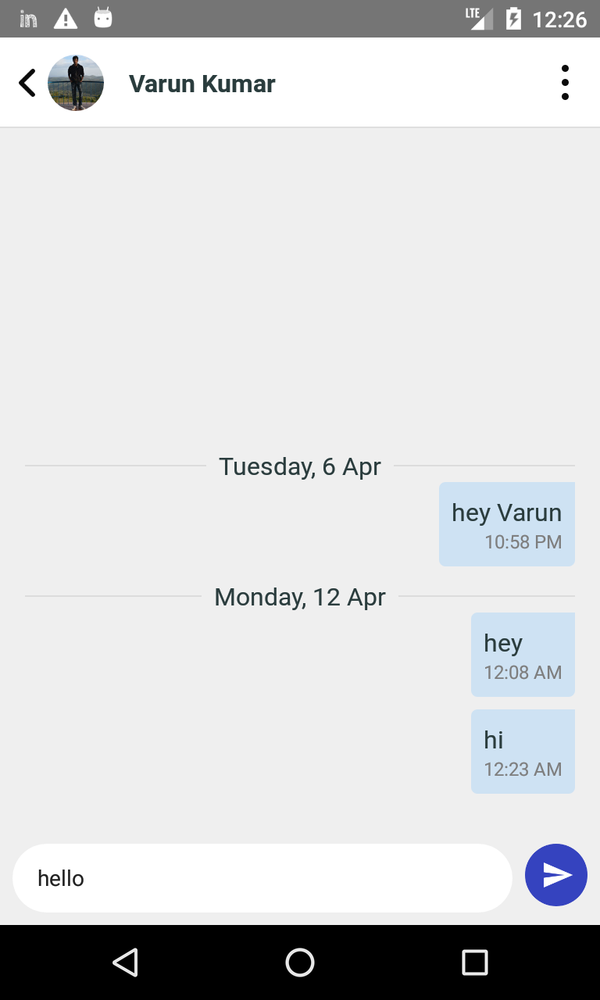

# react-native-self-chat
A self Chat app built using Firebase &amp; react-native. 

## Features

1. By default, user can chat with himself
2. User can also create new virtual contacts and chat with them (of course it would be one way)

## Firestore collections & documents

1. Users - `/users`
2. Chats of a particular user - `/users/:uid/chats`
3. One particular chat of a user - `/users/:uid/chats/:chatId/messages`
4. One particular message - `/users/:uid/chats/:chatId/messages/:messageId`

## Firestore Schema

1. User
  - uid
  - name
  - email
  - profileUrl
  - createdAt
  - chats (collection)
2. Chat
  - recipient
    - name
    - profileUrl
  - createdAt
  - lastMessage
    - messageType (TEXT/IMAGE)
    - text (when `messageType == TEXT`) 
    - createdAt
  - messages (collection)
3. Message
  - messageId
  - messageType (TEXT/IMAGE)
  - text (when `messageType == TEXT`) 
  - imageUrl (when `messageType == IMAGE`) 
  - createdAt

## Firestore Rules

```
rules_version = '2';
service cloud.firestore {
  match /databases/{database}/documents {
    match /users/{uid}/{document=**} {
      allow read, write: if request.auth.uid == uid;
    }
  }
}
```

## Screenshots

 
